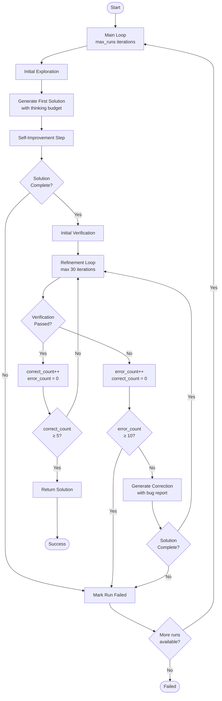
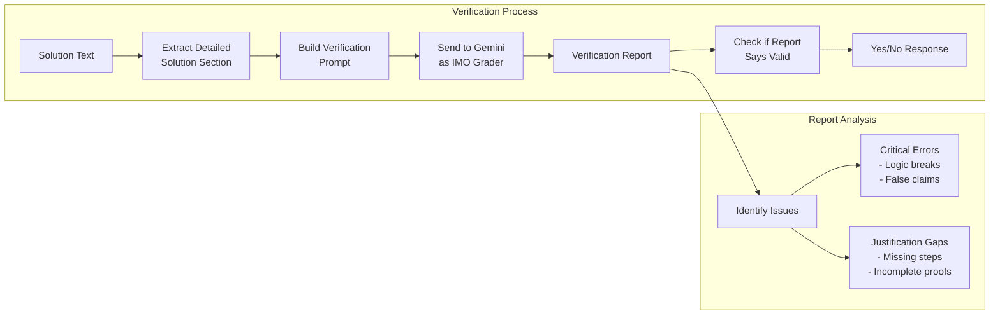

# Agent Control Flow Documentation

## Overview

The IMO Problem Solver Agent implements a sophisticated multi-stage approach to solving International Mathematical Olympiad problems using Google's Gemini 2.5 Pro model. The agent employs self-improvement and verification loops to ensure solution correctness and completeness.

## High-Level Architecture



## Detailed Control Flow

### 1. Entry Point (`__main__`)

The agent starts with command-line argument parsing:
- **Input**: Problem file path (required)
- **Options**: 
  - `--log`: Log file path
  - `--other_prompts`: Additional prompts (comma-separated)
  - `--max_runs`: Maximum number of complete attempts (default: 10)

### 2. Multiple Run Loop

The agent attempts to solve the problem up to `max_runs` times:
```python
for i in range(max_runs):
    solution = agent(problem_statement, other_prompts)
    if solution is not None:
        break
```

### 3. Agent Function Flow

#### Phase 1: Initial Exploration (`init_explorations`)

1. **First Solution Generation**
   - Sends problem statement with `step1_prompt` (rigorous mathematical solution instructions)
   - Uses Gemini's thinking budget (32768 tokens) for deep reasoning
   - Extracts the generated solution

2. **Self-Improvement Step**
   - Appends the first solution to the conversation
   - Sends `self_improvement_prompt` asking the model to review and improve
   - Model corrects errors and fills justification gaps

3. **Completeness Check**
   - Verifies if the solution claims to be complete
   - If not complete, returns None (failure)

4. **Initial Verification**
   - Runs the solution through a separate verification prompt
   - Uses `verification_system_prompt` (IMO grader persona)
   - Checks for critical errors and justification gaps

#### Phase 2: Refinement Loop

The agent enters a refinement loop (maximum 30 iterations) with two counters:
- `correct_count`: Consecutive successful verifications
- `error_count`: Consecutive failed verifications

**Loop Logic:**

1. **If Verification Fails** (`"yes" not in good_verify`):
   - Reset `correct_count` to 0
   - Increment `error_count`
   - Build correction prompt with:
     - Original problem
     - Current solution
     - Bug report from verification
   - Generate improved solution
   - Check completeness again

2. **If Verification Succeeds**:
   - Increment `correct_count`
   - Reset `error_count` to 0

3. **Termination Conditions**:
   - **Success**: `correct_count >= 5` (5 consecutive successful verifications)
   - **Failure**: `error_count >= 10` (10 consecutive failed verifications)
   - **Timeout**: 30 iterations reached

### 4. Verification Process (`verify_solution`)

The verification system works in two stages:



1. **Detailed Verification**:
   - Extracts the "Detailed Solution" section
   - Sends it to a separate verification prompt
   - Verification prompt acts as an IMO grader
   - Identifies:
     - Critical errors (breaks logical chain)
     - Justification gaps (incomplete reasoning)

2. **Verification Assessment**:
   - Asks a simple yes/no question about verification result
   - Determines if solution passed verification

### 5. Prompt Templates

The system uses five main prompts (loaded from `prompts/` directory):

1. **`step1_prompt.txt`**: Core instructions for rigorous mathematical solution
2. **`self_improvement_prompt.txt`**: Instructions for self-review and improvement
3. **`correction_prompt.txt`**: Instructions for fixing identified issues
4. **`verification_system_prompt.txt`**: IMO grader persona for verification
5. **`verification_reminder.txt`**: Reminder to generate verification log

## Key Design Decisions

### Why Multiple Verifications?

The requirement for 5 consecutive successful verifications ensures:
- Solution stability (not a lucky single pass)
- Robustness against false positives
- Comprehensive checking from multiple angles

### Why Separate Verification?

Using a separate verification prompt with a different persona:
- Provides an independent check
- Catches errors the solver might miss
- Mimics real IMO grading process

### Why Self-Improvement?

The self-improvement step:
- Allows the model to catch its own mistakes
- Improves solution quality before verification
- Reduces the number of correction iterations needed

## Failure Modes

The agent can fail in several ways:

1. **Incomplete Solution**: Model admits it cannot find complete solution
2. **Repeated Verification Failures**: 10 consecutive failed verifications
3. **Iteration Timeout**: 30 iterations without success
4. **API Errors**: Network or API issues
5. **All Runs Exhausted**: `max_runs` attempts all fail

## Performance Considerations

- **Thinking Budget**: 32768 tokens allows deep reasoning but increases response time (5-15 minutes)
- **Temperature**: Set to 0.1 for consistent, focused responses
- **Parallel Execution**: `run_parallel.py` runs multiple agents to increase success probability

## Success Metrics

Based on the paper's results:
- Single agent success rate: ~20-40% depending on problem difficulty
- Multiple agents (10-20): Can achieve 60-80% success rate
- Verification accuracy: High precision in identifying correct solutions

## Future Improvements

Potential enhancements not yet implemented:
- Dynamic thinking budget based on problem complexity
- Adaptive verification threshold
- Problem-specific prompt engineering
- Integration with symbolic math verification tools